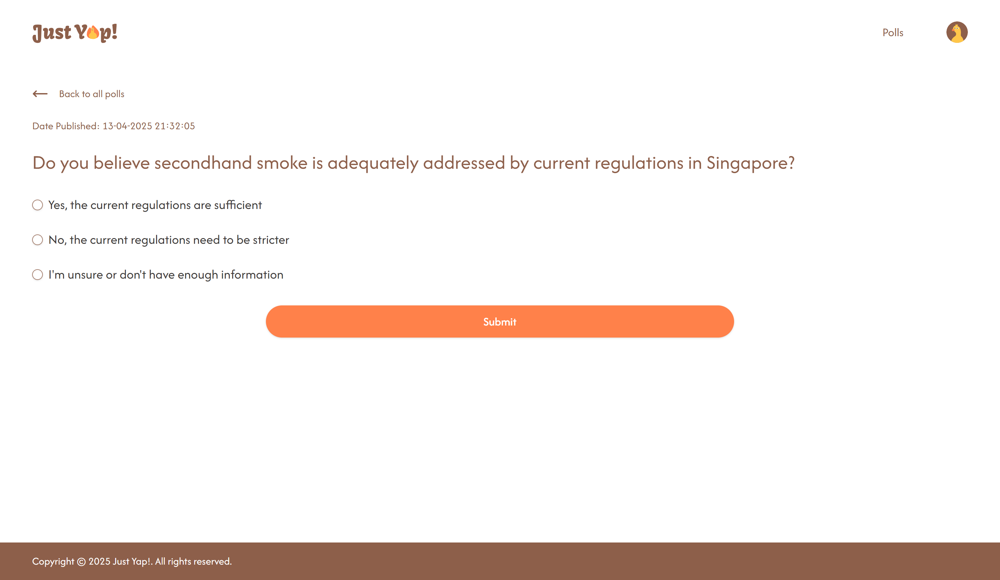
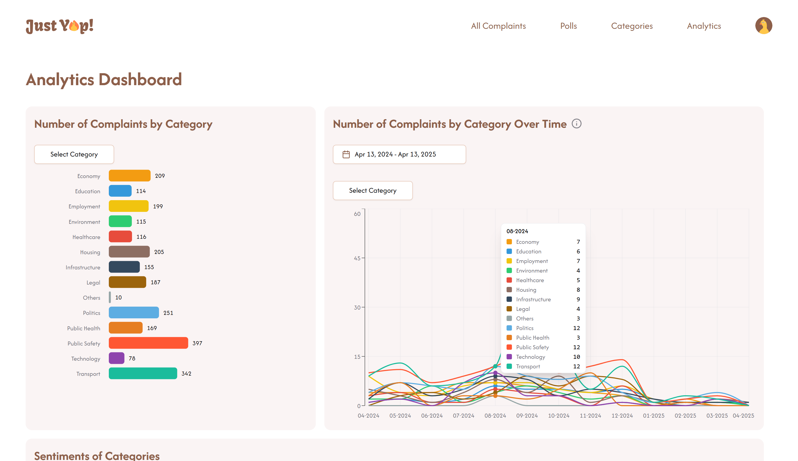

# Just Yap!

## About
Singaporeans frequently voice complaints on social media, but these platforms are cluttered with irrelevant content, making it hard to distill actionable insights. 

Just Yap! addresses this gap by collecting real-time complaints from social media, then using AI and machine learning to filter, categorise and analyse them. It visualises key insights to help authorities better understand public concerns. Additionally, Just Yap! generates AI-suggested polls, enabling government agencies to engage citizens on trending issues, fostering responsive and data-driven policymaking.

Currently, our real-time data collection pipeline collects complaints from the r/Singapore subreddit. In the future, we look forward to extending it to other sources like Facebook.

<div align="center">
    
</div>


## Core Features (User-facing)
### Feature 1: View All Complaints
View the full list of social media complaints collected from our real-time data collection pipeline. 

**Operations supported (Admin):**
1. Search by keyword in title and description
2. Filter by category
3. Sort by date posted and sentiment (ascending, descending or none)
4. Browse up to 100 complaints per page


<div align="center">
    <br />
    
</div>


### Feature 2: Polls
As an admin, engage the citizens with polls. Just Yap! offers AI-recommended poll templates based on complaints from the past 6 months, allowing you to engage citizens on trending issues.

As a citizen, have you voice heard by participating in polls and earn fun digital collectibles along the way.


**Operations supported (Admin):**
1. Browse poll templates
2. Create new MCQ or open-ended polls from scratch or based on existing poll templates
3. Edit or delete a poll
4. Publish a poll (Make polls live so citizens can participate)
5. Close a poll (Prevent further responses from citizens)
6. Republish a poll (Reopen closed polls to get more responses from citizens)
7. View poll responses + Export poll responses as CSV (Note: CSV export is supported for open-ended polls only)


**Operations supported (Citizen):**
1. Participate in polls.
2. Earn unique digital collectibles (Ps... There are 6 different ones to collect! 😉)


<div align="center">
    <br />
    
</div>


### Feature 3: Category Analytics
View category-specific analytics generated biannually, using complaint data from the past six months. For each category, the category analytics include:
- Summary
- Trending keywords
- ABSA results
- Concerns
- Suggestions
- Most negative complaints
- Statistics (Total number of complaints, sentiment score, forecasted sentiment)
- Number of complaints over time (Graph visualisation)
- Sentiment over time (Graph visualisation)

**Operations supported (Admin):**
1. View category analytics.
2. Download category analaytics as a PDF.


<div align="center">
    <br />
    
</div>


### Feature 4: Analytics Dashboard
View overall analytics of complaints across all categories, offering a bird’s-eye view of key statistics and trends from the social media complaints.

**Operations supported (Admin):**

The admin can view all of the following in the analytics dashboard.
1. Number of complaints by category (Multi-select option for category)
2. Number of complaints by category over time (Multi-select option for category and date selector for time period)
3. Sentiments of categories (Multi-select option for category)
4. Number of complaints by sentiment
5. Sentiments of sources
6. Sentiments of categories over time (Multi-select option for category and date selector for time period)
7. Most negative complaints


<div align="center">
    <br />
    
</div>


## Tech Stack
The following technologies are used to build the frontend web application of Just Yap!.

- Next.JS
- TailwindCSS
- shadcn
- Flowbite
- SWR

## Development Setup
Follow these steps to step up the frontend web application locally.

1. Clone the repository to a folder of your preference.
```
git clone https://github.com/nus-cs3203/CS3203_3_Frontend.git
```

2. Run the following command in the root folder to install the necessary dependencies. You will need to install [NodeJS](https://nodejs.org/en/download) for this.
```
npm install
```
3. Start the web application on your local server. By default, it runs on `http://localhost:3000`.
```
npm run dev
```
4. Run the backend API on your local server. To do so, follow the instructions mentioned in the [backend repository](https://github.com/nus-cs3203/CS3203_3_Backend). By default, the backend API will run on `http://localhost:8082`, `http://localhost:8083`, `http://localhost:8085`.

```
//After building the backend docker image using docker compose build
docker compose up
```
5. Start interacting with Just Yap! in your browser by going to `http://localhost:3000`. 😊


## Testing

### Unit Tests
Unit tests, implemented using Jest, are found in the [`__tests__`](/__tests__/) folder. Run these commands in the root folder to execute the unit tests.

```
//To run all unit tests
npm run test
```

```
//To run all unit tests in a particular folder within __tests__
//For example, <folder_name> could be helper_functions
npm test -- __tests__/<folder_name>
```

```
//To run one particular unit test
//For example, <path> could be helper-functions/getRandomCollectible.test.tsx 

npm test -- __tests__/<path>
```

### End-to-End UI Tests
The UI tests, implemented using Playwright, test end-to-end user flows which involve the frontend interacting with the backend. UI tests are found in the [`tests`](/tests/) folder.

To run the UI tests, follow these steps.

1. Head to this [Google drive link](https://drive.google.com/file/d/1sbrbNVplz2klM286PENeHhf1xHvXS12_/view?usp=sharing) and download the zipped folder called `data`. Unzip it and you should find five CSV files.

2. Create a folder called `data` within the [`scripts`](/scripts/) folder. Place all five CSV files into this `data` folder.


3. Run the frontend on the local server.
```
npm run dev
```

4. Run the backend on the local server.
```
docker compose up
```

5. Start running the UI tests.

```
//To run one particular UI test
//For example, <path> could be admin/complaints/changeComplaintCategory.spec.mjs
npx playwright test tests/<path> --ui
```

```
//To run all UI tests at once
npx playwright test
```

> [!NOTE]
> The UI tests are configured to run using one worker only to avoid race conditions in the database. Thus, they are time-consuming to run. We advise **running one UI test at a time** instead of running all UI tests at once.

> [!NOTE]
> The tests are configured to run a Python script to reset the database after each test. Thus, ensure that you have Python installed before running the tests.

> [!TIP]
> It is good practice to stop your local MongoDB server before running `docker compose up`. For Windows users, run `net stop mongodb` in a command prompt.


